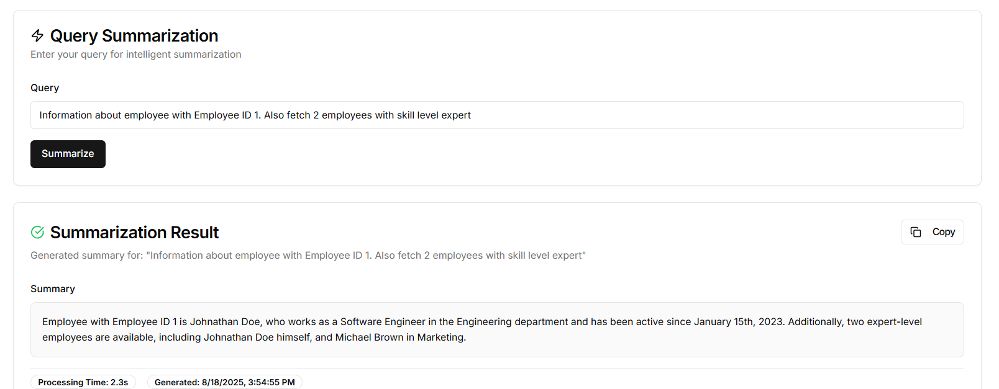

# Endpoints

## 1. Orchestrator

## 2. Navigation

### Usage:

### List Intent:

### Add Intent:

### Edit Intent:

### Test Navigation:

## 3. Summarization

### Usage:

### Chained Summarization:

## 4. Task Execution

### Usage:

### Result:

